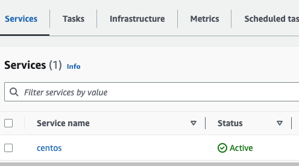
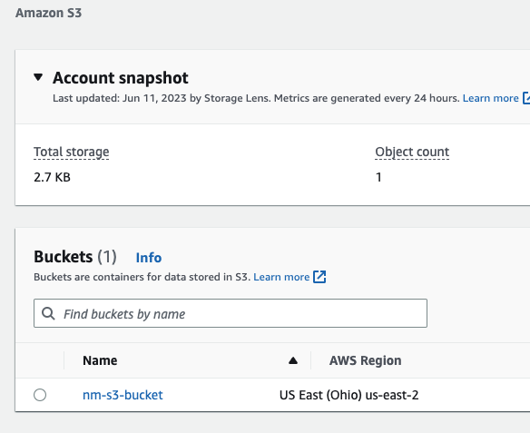

# docker_terraform_AWS

Deploy a Docker container using Terraform with ECS and S3


Docker is a platform to build, share and run modern applications. it handles the setup so you can focus on code itself.

Terraform is an open-source infrastructure as code software tool that enables you to safely and predictably create, change and improve infra.

Agenda:

1. Pull a centos image from the Docker registry.
2. Create an AWS ECS cluster using the docker image with Terraform.
3. Create remote backend to store terraform state file in S3.

Step 1: Create AWS S3 bucket to store the backend and state file.

```
# Create S3 bucket

resource "aws_s3_bucket" "state" {
    bucket = "nm-bucket"
}
```

providers.tf

```
terraform {
    required_providers {
        aws = {
            source  = "hashicorp/aws"
            version = "~> 4.16"
        }

        docker = {
            source = "kreuzwerker/docker"
        }
    }
}
```

Next terraform init and terraform apply for creating s3 bucket


Step 2: In order to configure an ECS cluster, I’ll include the needed code for a VPC and private subnet.

```
resource "aws_vpc" "vpc_ecs" {
    cidr_block = "10.10.0.0/16"

    tags {
        Name = "vpc-ecs"
    }
}

resource "aws_subnet" "private_subnet" {
    vpc_id            = aws_vpc.vpc_ecs.id
    cidr_block        = "10.10.1.0/24"
    availability_zone = "us-east-2a"

    tags {
        Name = "private-subnet"
    }
}
```

I will also include resources for the cluster, service, and task definition.

```
resource "aws_ecs_cluster" "nm_cluster" {
    name = "nm-cluster"
}

resource "aws_ecs_cluster_capacity_providers" "nm_cluster_cp" {
    cluster_name = aws_ecs_cluster.nm_cluster.name 

    capacity_providers = ["FARGATE"]

    default_capacity_provider_strategy {
        base              = 1
        weight            = 100
        capacity_provider = "FARGATE"
    }
}

resource "aws_ecs_service" "centos" {
    name            = "centos"
    cluster         = aws_ecs_cluster.nm_cluster.id
    task_definition = aws_ecs_task_definition.centos.arn
    desired_count   = 1
    launch_type     = "FARGATE"
    network_configuration {
        subnets = [aws_subnet.private_subnet.id]
    }
}

resource "aws_ecs_task_definition" "centos" {
    family                   = "centos"
    network_mode             = "awsvpc"
    required_compatibilities = ["FARGATE]
    cpu                      = 256
    memory                   = 512
    container_definitions = jsonencode([
        {
            name = "centos"
            image = "centos:8"
            cpu = 256
            memory = 512
            essential = true
            portMappings = [
                {
                    containerPort = 80
                    hostPort = 80
                }
            ]
                    }
    ])
}
```

Again, I will run the terraform init, terraform validate, terraform plan, and terraform apply commands and execute the full code.

When I head over to the console, I can see that I have an ECS Cluster.




I can also view my S3 bucket and see that I have 1 object stored now.




My terraform.tfstate file is located in the S3 bucket successfully. Note that by default, S3 buckets are private.

I can also run the terraform state list command and see the same resources listed via the IDE.

```
terraform state list
aws_ecs_cluster.nm_cluster
aws_ecs_cluster_capacity_providers.nm_cluster_cp
aws_ecs_service.centos
aws_ecs_task_definition.centos
aws_s3_bucket.first
aws_subnet.private_subnet
aws_vpc.vpc_ecs
```

Tear down to avoid any unwanted charges

```
terraform destroy
```

